<!--

* Curso: Albañiles digitales.

* Nombre del proyecto: "Manual Markdown".

* Autor: Koldo Sanmartín.

* Fecha creación: Viernes 29/11/2024.

* Última revisión: Domingo 01/12/2024.

* Lugar: Pamplona, España.

* Líneas de código: 1914.

* Descripción:

   Esto es un "breve" manual que intenta ser una guía básica sobre los archivos .md (Markdown), enfocado en cómo usar los archivos para poder verlos óptimamente renderizados.

-->

# <u style="color:green;"> Guía Básica sobre Archivos .md (Markdown). </u>


<mark> (Logo de Markdown.) </mark>

Los archivos `.md` son archivos de `Markdown`, un lenguaje de marcado ligero utilizado para formatear texto de manera simple. `Markdown` es popular debido a su facilidad de uso y legibilidad, lo que lo hace ideal para escribir documentación, blogs, README de proyectos, y otros tipos de contenido estructurado.

---

## Índice.

- ¿Para qué sirven los archivos `.md`? [ir](#para-qué-sirven-los-archivos-md)

- ¿Cómo funcionan los archivos `.md`? [ir](#cómo-funcionan-los-archivos-md)

- Creando y editando archivos `.md`. [ir](#creando-y-editando-archivos-md)

- Ventajas de `Markdown`. [ir](#ventajas-de-markdown)

- Estructura básica de `Markdown`. [ir](#estructura-básica-de-markdown)

  1. Encabezados. [ir](#1-encabezados)

  2. Párrafos. [ir](#2-párrafos)

  3. Listas. [ir](#3-listas)

  4. Negrita, cursiva y tachado. [ir](#4-negrita-cursiva-y-tachado)

  5. Enlaces. [ir](#5-enlaces)

     1. Enlaces externos. [ir](#1-enlaces-externos)

     2. Referencias de enlaces. [ir](#2-referencias-de-enlaces)

     3. Archivos incrustados. [ir](#3-archivos-incrustados)

     4. Lista de referencias de pie de página. [ir](#4-lista-de-referencias-de-pie-de-página)

     5. Tablas de contenido (TOC). [ir](#5-tablas-de-contenido-toc)

     6. Imágenes. [ir](#6-imágenes)

     7. Enlaces internos dentro del propio archivo `Markdown`. [ir](#7-enlaces-internos-dentro-del-propio-archivo-markdown)

  6. Citas. [ir](#6-citas)

  7. Código. [ir](#7-código)

  8. Tablas. [ir](#8-tablas)

  9. Separadores. [ir](#9-separadores)

  10. Tareas. [ir](#10-tareas)

  11. Comentarios en `Markdown`. [ir](#11-comentarios-en-markdown)

  12. Escapar caracteres. [ir](#12-escapar-caracteres)

  13. `Markdown` avanzado con `HTML`. [ir](#13-markdown-avanzado-con-html)

  14. Admoniciones (Notas, consejos, advertencias). [ir](#14-admoniciones-notas-consejos-advertencias)

      1. Admoniciones con estilo. [ir](#1-admoniciones-con-estilo)

      2. En sistemas que renderizan `HTML` o que soportan `Markdown` extendido, puedes usar colores en el texto. [ir](#2-en-sistemas-que-renderizan-html-o-que-soportan-markdown-extendido-puedes-usar-colores-en-el-texto)

      3. Admoniciones personalizadas en `HTML`. [ir](#3-admoniciones-personalizadas-en-html)

      4. Admoniciones en `Jupyter Notebook`. [ir](#4-admoniciones-en-jupyter-notebook)

      5. En sistemas avanzados como `MkDocs`. [ir](#5-en-sistemas-avanzados-como-mkdocs)

  15. Matemáticas con `LaTeX` [`MathJax` o `KaTeX` (Fórmulas matemáticas)]. [ir](#15-matemáticas-con-latex-mathjax-o-katex-fórmulas-matemáticas)

      1. Ecuaciones en línea. [ir](#1-ecuaciones-en-línea)

      2. Ecuaciones en bloque. [ir](#2-ecuaciones-en-bloque)

      3. Sumas y productos. [ir](#3-sumas-y-productos)

      4. Fracciones. [ir](#4-fracciones)

      5. Radicales. [ir](#5-radicales)

      6. Matrices. [ir](#6-matrices)

      7. Exponentes y subíndices. [ir](#7-exponentes-y-subíndices)

      8. Integrales. [ir](#8-integrales)

      9. Límites. [ir](#9-límites)

      10. Teoremas y notación matemática avanzada. [ir](#10-teoremas-y-notación-matemática-avanzada)

  16. Colores y estilos personalizados. [ir](#16-colores-y-estilos-personalizados)

  17. Detalles y resúmenes (`collapsible`). [ir](#17-detalles-y-resúmenes-collapsible)

  18. Diagramas `mermaid`. [ir](#18-diagramas-mermaid)

      1. Diagramas de árboles (Diagramas de decisiones). [ir](#1-diagramas-de-árboles-diagramas-de-decisiones)

          a. Decisiones en procesos. [ir](#a-decisiones-en-procesos)

          b. Diagramas de programación (Algoritmos). [ir](#b-diagramas-de-programación-algoritmos)

            1. Para representar estructuras básicas. [ir](#1-para-representar-estructuras-básicas)

            2. Diagramas personalizados con estilos. [ir](#2-diagramas-personalizados-con-estilos)

            3. Algoritmos bien extructurados. [ir](#3-algoritmos-bien-extructurados)

      2. Diagramas de secuencia. [ir](#2-diagramas-de-secuencia)

      3. Diagramas de `Gantt`. [ir](#3-diagramas-de-gantt)

      4. Diagramas de mapeo mental. [ir](#4-diagramas-de-mapeo-mental)

      5. Diagramas de clase (`UML`). [ir](#5-diagramas-de-clase-uml)

      6. Diagramas de entidad-relación (`ERD`). [ir](#6-diagramas-de-entidad-relación-erd)

      7. Diagramas de cuadrículas. [ir](#7-diagramas-de-cuadrículas)

         1. Diagramas de cuadrículas (`Pie chart`). [ir](#1-diagramas-de-cuadrículas-pie-chart)

         2. Diagramas de cuadrículas (`Requirement diagrams`). [ir](#2-diagramas-de-cuadrículas-requirement-diagrams)

         3. Diagramas de cuadrículas (`Timeline`). [ir](#3-diagramas-de-cuadrículas-timeline)

         4. Diagramas de cuadrículas (`Git graph`). [ir](#4-diagramas-de-cuadrículas-git-graph)

      8. Diagramas de definición de objetos (`C4 diagrams`). [ir](#8-diagramas-de-definición-de-objetos-c4-diagrams)

      9. Diagramas de estados. [ir](#9-diagramas-de-estados)

      10. Diagramas de viaje del usuario (`User Journey`). [ir](#10-diagramas-de-viaje-del-usuario-user-journey)

      11. Diagramas de flujo cíclico. [ir](#11-diagramas-de-flujo-cíclico)

      12. Diagramas de redes. [ir](#12-diagramas-de-redes)

      13. Diagramas de pila. [ir](#13-diagramas-de-pila)
  
  19. `Markdown` en `GitHub`. [ir](#19-markdown-en-github)

  20. `Plugins` para `Markdown`. [ir](#20-plugins-para-markdown)

- Resumen. [ir](#resumen)

---

## ¿Para qué sirven los archivos `.md`?

[ir a índice](#índice)

Los archivos `.md` se utilizan principalmente para:

1. **Documentación de proyectos**: En plataformas como `GitHub`, `GitLab` o `Bitbucket`, los archivos `README.md` se usan para describir el proyecto, cómo usarlo, cómo instalarlo, etc.
  
2. **Blogging y escritura**: Muchas plataformas de blogging permiten escribir en `Markdown` debido a su simplicidad.

3. **Notas y listas**: Son útiles para escribir notas organizadas, listas, resúmenes, etc.

---

## ¿Cómo funcionan los archivos `.md`?

[ir a índice](#índice)

`Markdown` se convierte en un formato más enriquecido como `HTML` o `PDF` cuando se procesa con un convertidor adecuado (por ejemplo, `GitHub` convierte automáticamente los archivos `.md` en vistas visuales cuando los ves en su interfaz). Básicamente, `Markdown` es un formato **sin complicaciones** para escribir texto estructurado, sin tener que escribir etiquetas `HTML` complejas.

---

## Creando y editando archivos `.md`.

[ir a índice](#índice)

1. **Cómo crear un archivo `.md`**:
   - Puedes crear un archivo `.md` con cualquier editor de texto (por ejemplo, `Visual Studio Code`, `Sublime Text`, `Atom`).
   - Simplemente crea un archivo con extensión `.md`, como `README.md`, y empieza a escribir en `Markdown`.

2. **Cómo ver el archivo `.md` renderizado**:
   - En plataformas como `GitHub`, cuando subes un archivo `.md`, lo verás renderizado en su interfaz web (convertido a `HTML`).
   - Si lo trabajas en tu máquina local, algunos editores de texto (como `Visual Studio Code`) permiten previsualizar el archivo `Markdown`.

3. **Dónde usar `Markdown`**:
   - **GitHub**: Para los archivos `README.md`, `documentación de proyectos`, `wikis`.
   - **Foros y plataformas de discusión** (como `Reddit`).
   - **Blogs y sitios estáticos**: Muchas plataformas de blogging como `Jekyll` o `Hugo` usan `Markdown`.

---

## Ventajas de `Markdown`.

[ir a índice](#índice)

- **Simplicidad**: No necesitas recordar muchas etiquetas o sintaxis complejas.
- **Legibilidad**: El texto en `Markdown` es fácilmente legible, incluso si no está renderizado.
- **Portabilidad**: Los archivos `.md` son simples archivos de texto que puedes abrir y editar en cualquier lugar.

---

## Estructura básica de `Markdown`.

[ir a índice](#índice)

Aquí te explico cómo escribir archivos `.md` con algunos ejemplos comunes (<mark>20 apartados en total</mark>):

---

### 1. Encabezados.

[ir a índice](#índice)

Los encabezados se crean con `#`. El número de `#` indica el nivel del encabezado (de 1 a 6).

```markdown
#### Encabezado de nivel 4.
##### Encabezado de nivel 5.
###### Encabezado de nivel 6.
```

#### Encabezado de nivel 4.

##### Encabezado de nivel 5.

###### Encabezado de nivel 6.

Esto se convierte en un encabezado con diferente tamaño dependiendo del número de `#`.

---

### 2. Párrafos.

[ir a índice](#índice)

Los párrafos se escriben de forma normal, solo se separan por líneas vacías.

```markdown
Este es un párrafo. Al escribir más texto aquí, sigue siendo parte del mismo párrafo.

Este es otro párrafo.
```

Este es un párrafo. Al escribir más texto aquí, sigue siendo parte del mismo párrafo.

Este es otro párrafo.

---

### 3. Listas.

[ir a índice](#índice)

- **Listas no ordenadas**: Se hacen con asteriscos (`*`), guiones (`-`) o más (`+`).

  ```markdown
  - Elemento 1.
  - Elemento 2.
  - Elemento 3.
  ```

  - Elemento 1.
  - Elemento 2.
  - Elemento 3.

- **Listas ordenadas**: Se hacen con números seguidos de un punto.

  ```markdown
  1. Primer elemento.
  2. Segundo elemento.
  3. Tercer elemento.
  ```

  1. Primer elemento.
  2. Segundo elemento.
  3. Tercer elemento
  
  ```markdown
    - Elemento 1.
    - Elemento 2.
      - Sub-elemento
    1. Elemento 1.
    2. Elemento 2.
       1. Sub-elemento.
  ```

  - Elemento 1.
  - Elemento 2.
    - Sub-elemento
  1. Elemento 1.
  2. Elemento 2.
     1. Sub-elemento.

---

### 4. Negrita, cursiva y tachado.

[ir a índice](#índice)

- Para **negrita**, usa dos asteriscos (`**`).
- Para *cursiva*, usa un asterisco (`*`).
- Para ~~tachado~~, usa dos virgulillas (`~~`) (`Alt Gr + ñ`).
- Para <u>subrayado</u> se usa html entre las etiquetas `<u>` y `</u>`.

```markdown
**Este texto está en negrita.**
*Este texto está en cursiva.*
~~Este texto está tachado.~~
<u>Este texto está en subrayado.</u>
```

**Este texto está en negrita.**
*Este texto está en cursiva.*
~~Este texto está tachado.~~
<u>Este texto está en subrayado.</u>

---

### 5. Enlaces.

[ir a índice](#índice)

`Markdown` permite realizar diversos tipos de enlaces, tanto dentro del propio archivo `markdown`, como fuera de él, incluyendo enlaces a otras páginas web, incrustar imágenes o logotipos, incluso referencias a otros archivos dentro de tu entorno local (`TOC`).

---

#### 1. Enlaces externos.

[ir a índice](#índice)

Los enlaces se crean con corchetes `[]` para el texto visible y paréntesis `()` para la URL. Puedes poner los enlaces solos, pero encerredos entre `menor que` y `mayor que` (`<>`).

```markdown
[Google](https://www.google.com)
[Enlace con título](https://www.google.com "Ir a Google")
Enlace suelto <https://www.google.com>
```

[Google](https://www.google.com)
[Enlace con título](https://www.google.com "Ir a Google")
Enlace suelto <https://www.google.com>

---

#### 2. Referencias de enlaces.

[ir a índice](#índice)

Puedes definir enlaces de forma reutilizable al final del documento:

```markdown
Esto es un [enlace][google].
<!-- Esto lo escribes al final del documento -->
[google]: https://www.google.com
```

Esto es un [enlace][google].
<!-- Esto lo escribes al final del documento -->
[google]: https://www.google.com

---

#### 3. Archivos incrustados.

[ir a índice](#índice)

Puedes incluir imágenes, videos, o enlaces a otros archivos en plataformas que lo permitan:

   ```markdown
   
   [Descargar archivo](ruta/archivo.zip)
   ```

   
   [Descargar archivo](ruta/archivo.zip)

---

#### 4. Lista de referencias de pie de página.

[ir a índice](#índice)

   Puedes añadir referencias al pie del documento (pero no hace falta escribirla allí, la pones debajo y `markdown` se ocupa de trasladarla al final del documento):

   ```markdown
   Esto es un texto con una referencia[^1].
   [^1]: Esta es la referencia al pie de página.
   ```

   Esto es un texto con una referencia[^1].
   [^1]: Esta es la referencia al pie de página.

---

#### 5. Tablas de contenido (TOC).

[ir a índice](#índice)

En herramientas como `MkDocs`, puedes generar un índice automáticamente:

```markdown
[[TOC]]
```

[[TOC]]

Incluso puedes ir a otros archivos `.md` con esto.

```markdown
[[prueba.md]]
```

[[prueba.md]]

---

#### 6. Imágenes.

[ir a índice](#índice)

Las imágenes son similares a los enlaces, pero se agrega un signo de exclamación (`!`) antes del corchete.

```markdown


```


---

#### 7. Enlaces internos dentro del propio archivo `Markdown`.

[ir a índice](#índice)

- En documentación extensa, puedes crear enlaces a secciones del mismo documento:

```markdown
[Ir a la sección de código](#código)
## Código
Aquí está el contenido de la sección.
```

[Ir a la sección de código](#código)

##### Código.

(Aquí está el contenido de la sección.)

- En `Markdown`, los enlaces internos se crean utilizando una combinación de texto entre corchetes (`[]`) y un enlace anclado con el símbolo de hash (`#`) seguido de un identificador correspondiente al encabezado de destino.

- Cómo funcionan los enlaces internos:

  Identificador del encabezado. Los identificadores de los encabezados en `Markdown` son generados automáticamente a partir del texto del encabezado:
  - Se convierte todo el texto del encabezado a minúsculas.
  - Se eliminan caracteres especiales [excepto guiones altos y bajos (`- _`) y espacios, que se convierten en guiones altos (`-`) ].
  - Los espacios en blanco se reemplazan por guiones altos (`-`).

- Crear el enlace: Para enlazar a un encabezado, usa el formato:

```markdown
[Texto del enlace](#identificador-del-encabezado)
```

- Reglas adicionales:
  - Encabezados con varios niveles:
  Funciona con encabezados `#` a `######`.
  - Encabezados con caracteres especiales: `Markdown` elimina o adapta los caracteres que no son compatibles en `URLs`.

> Ejemplo: Un encabezado ### C++/Java se convierte en #cjava.
> Espacios: Se convierten en guiones (-).

---

### 6. Citas.

[ir a índice](#índice)

Las citas se hacen con el símbolo de mayor que (`>`).

```markdown
> Esto es una cita.
>> Cita anidada.
```

> Este es un texto citado.
>> Cita anidada.

---

### 7. Código.

[ir a índice](#índice)

- Para **código en línea**, utiliza una sola **tilde invertida** (\`).
  
   ```markdown
   Este es un `código en línea`.
   ```

   Este es un `código en línea`.

  - Puedes anidar un código de línea dentro de otro, añadiendo una tilde invertida más `` (`) ``, cada vez. Sirve por si te encuentras con otra tilde invertida que pertenece al texto en sí, no a `markdown`.

     ```markdown
     Ejemplo de uso `` (`) ``.
     ```

    Ejemplo de uso `` (`) ``.

- Para **bloques de código**, usa tres tildes invertidas (\`\`\`) o sangrías de 4 espacios.

    ````markdown
    ```javascript
       función saludo() {
          console.log("Hola");
       }
    ```
    ````  

    ````markdown
    ```javascript
       console.log('Hola, Markdown!');
    ```
    ````  

- Puedes anidar un bloques de código dentro de otros, añadiendo un acento agudo más `` (`) ``, cada vez.

   `````markdown
   ````markdown
   ```javascript
   función saludo() {
      console.log("Hola");
   }
   ```
   ````
   `````

---

### 8. Tablas.

[ir a índice](#índice)

Las tablas se crean utilizando guiones `(-)` y barras verticales `(|)`.

```markdown
| Columna 1 | Columna 2 | Columna 3 |
|-----------|-----------|-----------|
| Valor 1   | Valor 2   | Valor 3   |
| Valor A   | Valor B   | Valor C   |
```

| Columna 1 | Columna 2 | Columna 3 |
|-----------|-----------|-----------|
| Valor 1   | Valor 2   | Valor 3   |
| Valor A   | Valor B   | Valor C   |

Esto crea una tabla estructurada.

```markdown
| Columna 1 | Columna 2 | Columna 3 |
|-----------|-----------|-----------|
| Dato 1    | Dato 2    | Dato 3    |
| Dato A    | Dato B    | Dato C    |
```

| Columna 1 | Columna 2 | Columna 3 |
|-----------|-----------|-----------|
| Dato 1    | Dato 2    | Dato 3    |
| Dato A    | Dato B    | Dato C    |

Puedes alinear el texto a la izquierda `(:---)`, a la derecha `(---:)`, o centrarlo `(:---:)`, dependiendo de dónde coloque los dos puntos `(:)`:

```markdown
| Columna A      | Columna B      | Columna C      |
|:---------------|:--------------:|---------------:|
| Alineada a la izquierda | Centrada         | Alineada a la derecha |
|mas|datos|a escribir|
```

| Columna A      | Columna B      | Columna C      |
|:---------------|:--------------:|---------------:|
| Alineada a la izquierda | Centrada         | Alineada a la derecha |
|mas|datos|a escribir|

Tablas con filas de separación:

Las tablas en `Markdown` pueden incluir filas de separación para mejorar la legibilidad del código fuente. Por ejemplo, puedes agregar filas vacías para separar visualmente diferentes secciones:

| Columna 1 | Columna 2 |
|-----------|-----------|
| Dato A    | Dato B    |

| Columna 3 | Columna 4 |
|-----------|-----------|
| Dato C    | Dato D    |

---

### 9. Separadores.

[ir a índice](#índice)

Los separadores o líneas horizontales se crean con tres guiones `(---)`, asteriscos `(***)` o guiones bajos `(___)`, (aunque es mejor que uses el mismo siempre. si no quieres que el `markdownslint` te dé problemas).

```markdown
---
```

---

### 10. Tareas.

[ir a índice](#índice)

Crea listas de tareas con `- [ ]` o `- [x]`.

```Markdown
- [x] Tarea completada.
- [ ] Tarea pendiente.
(puedes seleccionar un recuadro en el mismo markdown renderizado).
```

- [x] Tarea completada.
- [ ] Tarea pendiente.

(puedes seleccionar un recuadro en el mismo markdown renderizado).

---

### 11. Comentarios en `Markdown`.

[ir a índice](#índice)

`Markdown` no tiene comentarios nativos, pero puedes usar `HTML` para ello:

```Markdown
<!-- No se verá renderizado -->
<!-- Esto es un comentario -->
```

<!-- No se verá renderizado -->
<!-- Esto es un comentario -->

---

### 12. Escapar caracteres.

[ir a índice](#índice)

Para mostrar caracteres especiales como `*`, `_`, `#`, etc., usa una barra invertida ` \ `.

```markdown
\*No estoy en cursiva o negrita.\*
```

\*No estoy en cursiva o negrita.\*

---

### 13. `Markdown` avanzado con `HTML`.

[ir a índice](#índice)

Puedes mezclar `HTML` con `Markdown` si necesitas más personalización.

```markdown
<p style="color:red;">Esto es HTML dentro de `Markdown` en rojo.</p>
```

<p style="color:red;">Esto es HTML dentro de `Markdown` en rojo.</p>

!!! warning ¡¡ Cuidado !!
     Esta acción puede dar errores con `markdownlint`.

!!! tip Consejo:
     Puedes configurar `markdownlint` (desde `VS code`) para permitir todas las etiquetas `HTML` en `Markdown`, deshabilitando completamente la `regla "MD033"` (que es la que permite habilitar o no etiquetas `HTML`). Para hacerlo, puedes configurar el archivo `settings.json` añadiendo el código `"MD033": false` siguiendo estos pasos:
    1. Abre la configuración de `VS Code`:
       En la barra superior, haz clic en `Archivo` → `Preferencias` → `Configuración` (o usa el atajo):[^2]
       [^2]: Para escribir la flecha usa (`Ctrl` + `Shift` + `U`) y luego escribe `2192`, seguido de `Enter` o `Espacio` para convertirlo en →.
       - Windows/Linux: (`Ctrl + ,`)
       - Mac: (`Cmd + ,`)
    En la esquina superior derecha de la configuración, haz clic en el ícono de `Abrir configuraciones JSON` (parece un documento con llaves `{}`).
    2. Configura `markdownlint`:
    Dentro del archivo `settings.json`, añade o actualiza el bloque para incluir la configuración de `Markdownlint` para aceptar todas las etiquetas `HTML`:
    `settings.json`:
       ```json
       {
           "files.autoSave": "afterDelay",
           "window.customTitleBarVisibility": "auto",
           "workbench.sideBar.location": "right",
           "workbench.colorTheme": "Andromeda",
           "markdownlint.config": {
               "MD033": false
           }
       }
       ```
       Si ya tienes configuraciones personalizadas, asegúrate de incluir `"MD033": false` dentro del bloque `"markdownlint.config"`.
    3. Guarda los cambios
    Guarda el archivo presionando:
       - Windows/Linux: (`Ctrl + S`)
       - Mac: (`Cmd + S`)
    4. Reinicia `VS Code` (opcional).
    Aunque no es siempre necesario, puedes reiniciar `Visual Studio Code` para asegurarte de que los cambios se apliquen correctamente.
    5. Verifica que `Markdownlint` permite `HTML`:
    - Abre un archivo `.md`.
    - Escribe `HTML` sin formato, por ejemplo:
        ```html
        <h1>Encabezado con HTML</h1>
        ```
        <h1>Encabezado con HTML</h1>
    `Markdownlint` ya no debería marcar errores relacionados con etiquetas `HTML`.
    Con esta configuración, `Markdownlint` permitirá todas las etiquetas `HTML` en tus documentos `Markdown`.

---

### 14. Admoniciones (Notas, consejos, advertencias).

[ir a índice](#índice)

---

#### 1. Admoniciones con estilo.

[ir a índice](#índice)

En plataformas como `GitHub` o `Jekyll`, puedes usar admoniciones con estilo:

```markdown
> **Nota**: Recuerda revisar la documentación oficial.
> **Consejo**: Puedes usar extensiones de `Markdown`.
> **Información importante**: Este bloque resalta detalles clave.
> **Advertencia**: Ten cuidado al realizar este paso.
> **Éxito**: ¡La operación fue exitosa!
> **Pista**: Puedes usar este truco para mejorar tu flujo de trabajo.
```

> **Nota**: Recuerda revisar la documentación oficial.
> **Consejo**: Puedes usar extensiones de `Markdown`.
> **Información importante**: Este bloque resalta detalles clave.
> **Advertencia**: Ten cuidado al realizar este paso.
> **Éxito**: ¡La operación fue exitosa!
> **Pista**: Puedes usar este truco para mejorar tu flujo de trabajo.

---

#### 2. En sistemas que renderizan `HTML` o que soportan `Markdown` extendido, puedes usar colores en el texto.

[ir a índice](#índice)

Puedes usar colores para resaltar información o usar etiquetas de fondo:

```markdown
<span style="color: blue;">💡 Consejo:</span> Usa colores para resaltar información.
```

<span style="color: blue;">💡 Consejo:</span> Usa colores para resaltar información.[^3]
[^3]: Para escribir la bombilla usa (`Ctrl` + `Shift` + `U`) y luego escribe `1F4A1`, seguido de `Enter` o `Espacio` para convertirlo en 💡.

```markdown
<span style="background-color: pink;"> ℹ️ Información:</span> Este fondo es personalizable.
```

<span style="background-color: pink;"> ℹ️ Información:</span> Este fondo es personalizable.[^4]
[^4]:  Para escribir el símbolo usa (`Ctrl` + `Shift` + `U`) y luego escribe `2139`, seguido de `Enter` o `Espacio` para convertirlo en ℹ️.

```html
<mark> ⚠️ Advertencia:</mark> Este fondo es una etiqueta fija con este color.
```

<mark> ⚠️ Advertencia:</mark> Este fondo es una etiqueta fija con este color.[^5]
[^5]: Para escribir el símbolo usa (`Ctrl` + `Shift` + `U`) y luego escribe `26A0`, seguido de `Enter` o `Espacio` para convertirlo en ⚠️.

---

#### 3. Admoniciones personalizadas en `HTML`.

[ir a índice](#índice)

Si estás renderizando `Markdown` a `HTML`, puedes crear bloques con colores o íconos personalizados.

```markdown
<div style="border: 1px solid green; padding: 10px; background-color: #e7f5e7;">
<strong>Éxito:</strong> Operación completada correctamente.
</div>
```

<div style="border: 1px solid green; padding: 10px; background-color: #e7f5e7;">
<strong>Éxito:</strong> Operación completada correctamente.
</div>

---

#### 4. Admoniciones en `Jupyter Notebook`.

[ir a índice](#índice)

Si usas Markdown dentro de `Jupyter Notebooks`, puedes emplear celdas para destacar puntos importantes con estilos `CSS` o simplemente con emojis para mayor claridad:

```markdown
> ⚠️ **Advertencia**: Recuerda guardar tu trabajo antes de ejecutar este paso.
```

> ⚠️ **Advertencia**: Recuerda guardar tu trabajo antes de ejecutar este paso.

```markdown
ℹ️ **Información**: Este paso es opcional, pero recomendado.
```

ℹ️ **Información**: Este paso es opcional, pero recomendado.

```markdown
⚠️ **Advertencia**: El archivo será eliminado permanentemente.
```

⚠️ **Advertencia**: El archivo será eliminado permanentemente.

```markdown
✅ **Éxito**: La operación se completó sin problemas.
```

✅ **Éxito**: La operación se completó sin problemas.[^6]
[^6]: Para escribir el símbolo usa (`Ctrl` + `Shift` + `U`) y luego escribe `2705`, seguido de `Enter` o `Espacio` para convertirlo en ✅.

```markdown
💡 **Consejo**: Usa atajos de teclado para mejorar la velocidad.
```

💡 **Consejo**: Usa atajos de teclado para mejorar la velocidad.

---

#### 5. En sistemas avanzados como `MkDocs`.

[ir a índice](#índice)

Son más atractivas, no dejan lugar a duda y muy sencillas de hacer, solo tienes que poner tres exclamaciones de cierre (`!!!`) y escribir en sangría de 4 espacios lo que quieras colocar dentro de él, pero no lo soportan todos los renderizadores, como el de `GitHub`.

```markdown
!!! note Nota
    Este es un bloque de nota. Se usa para información general.
```

!!! note Nota
    Este es un bloque de nota. Se usa para información general.

```markdown
!!! tip Consejo
    Este es un bloque de consejo. Ayuda a optimizar tu experiencia.
```

!!! tip Consejo
    Este es un bloque de consejo. Ayuda a optimizar tu experiencia.

```markdown
!!! success Éxito
    ¡Este es un bloque de éxito! Indica que algo funcionó correctamente.
```

!!! success Éxito
    ¡Este es un bloque de éxito! Indica que algo funcionó correctamente.

```markdown
!!! warning Advertencia
    Este es un bloque de advertencia. Úsalo para llamar la atención sobre riesgos.
```

!!! warning Advertencia
    Este es un bloque de advertencia. Úsalo para llamar la atención sobre riesgos.

```markdown
!!! danger Peligro
    Este es un bloque de peligro. Resalta acciones potencialmente destructivas.
```

!!! danger Peligro
    Este es un bloque de peligro. Resalta acciones potencialmente destructivas.

```markdown
!!! failure Fallo
    Algo salió mal, por favor inténtalo de nuevo.
```

!!! failure Fallo
    Algo salió mal, por favor inténtalo de nuevo.

```markdown
!!! example Ejemplo
    Aquí tienes un ejemplo que puedes seguir.
```

!!! example Ejemplo
    Aquí tienes un ejemplo que puedes seguir.

---

### 15. Matemáticas con `LaTeX` [`MathJax` o `KaTeX` (Fórmulas matemáticas)].

[ir a índice](#índice)

Si estás en un entorno que lo soporte, como `Jupyter Notebooks` o `MkDocs`, puedes usar fórmulas matemáticas.

Algunos motores de `Markdown` permiten usar notación matemática con `$`.

#### 1. Ecuaciones en línea.

[ir a índice](#índice)

Las ecuaciones en línea se escriben entre signos de dólar (`$`). Estas ecuaciones se alinean con el texto.

-Ejemplos:

```markdown
La famosa ecuación de Einstein es: $ E = mc^2 $.
```

La famosa ecuación de Einstein es: $ E = mc^2 $.

```markdown
La fórmula de la cuadrática es $ x = \frac{-b \pm \sqrt{b^2 - 4ac}}{2a} $.
```

La fórmula de la cuadrática es $ x = \frac{-b \pm \sqrt{b^2 - 4ac}}{2a} $.

#### 2. Ecuaciones en bloque.

[ir a índice](#índice)

Las ecuaciones en bloque se colocan entre dos conjuntos de signos de dólar dobles (`$$`). Estas ecuaciones se muestran centradas y en una línea separada.

-Ejemplo:

```markdown
La fórmula de la cuadrática es: 
$$ x = \frac{-b \pm \sqrt{b^2 - 4ac}}{2a} $$.
```

La fórmula de la cuadrática es:
$$ x = \frac{-b \pm \sqrt{b^2 - 4ac}}{2a} $$

#### 3. Sumas y productos.

[ir a índice](#índice)

Para escribir sumas o productos, puedes usar los símbolos `\sum` y `\prod`:

-Ejemplos:

```markdown
Suma de una serie:
$$ \sum_{i=1}^{n} i^2 = \frac{n(n+1)(2n+1)}{6} $$
```

Suma de una serie:
$$ \sum_{i=1}^{n} i^2 = \frac{n(n+1)(2n+1)}{6} $$

```markdown
Producto de una secuencia: $$ \prod_{i=1}^{n} i = n! $$
```

Producto de una secuencia: $$ \prod_{i=1}^{n} i = n! $$

#### 4. Fracciones.

[ir a índice](#índice)

Puedes usar `\frac{numerador}{denominador}` para escribir fracciones:

-Ejemplo:

```markdown
$$ \frac{1}{2} + \frac{1}{3} = \frac{5}{6} $$
```

$$ \frac{1}{2} + \frac{1}{3} = \frac{5}{6} $$

#### 5. Radicales.

[ir a índice](#índice)

Para escribir raíces cuadradas usa `\sqrt{expresión}` y otras raíces usa `\sqrt[n]{expresión}`, siendo `[n]` el numero de raíz que desees:

- Raíz cuadrada:

```markdown
$$ \sqrt{a^2 + b^2} = c $$
```

$$ \sqrt{a^2 + b^2} = c $$

- Otras raíces:

```markdown
\sqrt[3]{x + 1} + \sqrt[4]{x^2} - \sqrt[5]{y_1}
```

$$ \sqrt[3]{x + 1} + \sqrt[4]{x^2} - \sqrt[5]{y_1} $$

#### 6. Matrices.

[ir a índice](#índice)

Las matrices se escriben utilizando el entorno `\begin{matrix} ... \end{matrix}` para matrices  sin corchetes o `\begin{bmatrix} ... \end{bmatrix}` para matrices entre corchetes.

- Matriz simple entre corchetes:

```markdown
$$ \begin{bmatrix} a & b \\ c & d \end{bmatrix} $$
```

$$ \begin{bmatrix} a & b \\ c & d \end{bmatrix} $$

- Matriz simple sin corchetes:

```markdown
$$ \begin{matrix} a & b \\ c & d \end{matrix} $$
```

$$ \begin{matrix} a & b \\ c & d \end{matrix} $$

#### 7. Exponentes y subíndices.

[ir a índice](#índice)

Puedes usar (`^`) para exponentes y (`_`) para subíndices.

- Exponentes:

```markdown
$$ a^n = \sum_{i=1}^n i^2 $$
```

$$ a^n = \sum_{i=1}^n i^2 $$

- Subíndices:

```markdown
$$ a_i = b_{i+1} $$
```

$$ a_i = b_{i+1} $$

#### 8. Integrales.

[ir a índice](#índice)

Las integrales se escriben utilizando `\int` para la integral definida o indefinida:

```markdown
Teorema Fundamental del Cálculo: 
$$ \int_a^b f(x) dx = F(b) - F(a) $$
```

Teorema Fundamental del Cálculo:
$$ \int_a^b f(x) dx = F(b) - F(a) $$

#### 9. Límites.

[ir a índice](#índice)

Usa `\lim` para escribir límites:

```markdown
$$ \lim_{x \to \infty} \frac{1}{x} = 0 $$
```

$$ \lim_{x \to \infty} \frac{1}{x} = 0 $$

#### 10. Teoremas y notación matemática avanzada.

[ir a índice](#índice)

Puedes escribir teoremas y notación matemática avanzada de manera similar:

Teorema de Pitágoras:

```markdown
$$ cat_a^2 + cat_b^2 = hip^2\ ;\ 4^2 + 3^2 = 5^2\ ;\ 16 + 9 = 25 $$
```

$$ cat_a^2 + cat_b^2 = hip^2 \ ;\ 4^2 + 3^2 = 5^2\ ;\ 16 + 9 = 25 $$

---

### 16. Colores y estilos personalizados.

[ir a índice](#índice)

- Aunque `Markdown` puro no admite colores, puedes usar `HTML` en algunos casos:

```markdown
<span style="color: green;">Texto en verde.</span>
```

<span style="color: green;">Texto en verde.</span>

- Aquí tienes una lista de los más de 140 colores (147 exactamente) por nombre que puedes usar directamente en HTML:

Aqua, Black, Blue, Fuchsia, Gray, Green, Lime, Maroon, Navy, Olive, Purple, Red, Silver, Teal, White, Yellow, AliceBlue, AntiqueWhite, Aquamarine, Azure, Beige, Bisque, BlanchedAlmond, BlueViolet, Brown, BurlyWood, CadetBlue, Chartreuse, Chocolate, Coral, CornflowerBlue, Cornsilk, Crimson, Cyan, DarkBlue, DarkCyan, DarkGoldenRod, DarkGray, DarkGreen, DarkKhaki, DarkMagenta, DarkOliveGreen, DarkOrange, DarkOrchid, DarkRed, DarkSalmon, DarkSeaGreen, DarkSlateBlue, DarkSlateGray, DarkTurquoise, DarkViolet, DeepPink, DeepSkyBlue, DimGray, DodgerBlue, FireBrick, FloralWhite, ForestGreen, Fuchsia, Gainsboro, GhostWhite, Gold, GoldenRod, Gray, GreenYellow, HoneyDew, HotPink, IndianRed, Indigo, Ivory, Khaki, Lavender, LavenderBlush, LawnGreen, LemonChiffon, LightBlue, LightCoral, LightCyan, LightGoldenRodYellow, LightGray, LightGreen, LightPink, LightSalmon, LightSeaGreen, LightSkyBlue, LightSlateGray, LightSteelBlue, LightYellow, LimeGreen, Linen, Magenta, MediumAquaMarine, MediumBlue, MediumOrchid, MediumPurple, MediumSeaGreen, MediumSlateBlue, MediumSpringGreen, MediumTurquoise, MediumVioletRed, MidnightBlue, MintCream, MistyRose, Moccasin, NavajoWhite, OldLace, OliveDrab, Orange, OrangeRed, Orchid, PaleGoldenRod, PaleGreen, PaleTurquoise, PaleVioletRed, PapayaWhip, PeachPuff, Peru, Pink, Plum, PowderBlue, Purple, RebeccaPurple, Red, RosyBrown, RoyalBlue, SaddleBrown, Salmon, SandyBrown, SeaGreen, SeaShell, Sienna, Silver, SkyBlue, SlateBlue, SlateGray, Snow, SpringGreen, SteelBlue, Tan, Teal, Thistle, Tomato, Turquoise, Violet, Wheat, WhiteSmoke, YellowGreen.

Para colores específicos, necesitarás soporte `CSS` (en archivos `.md` renderizados como `HTML`).

- Etiquetas personalizadas.

Con algunos sistemas avanzados puedes añadir etiquetas con estilos únicos:

```markdown
<mark>Texto resaltado.</mark>
```

<mark>Texto resaltado.</mark>

---

### 17. Detalles y resúmenes (`collapsible`).

[ir a índice](#índice)

En `Markdown` avanzado o con soporte `HTML`, puedes crear bloques colapsables.

```markdown
<details>
  <summary>Haz clic para expandir.</summary>
  Aquí está el contenido oculto.
</details>
```

<details>
  <summary>Haz clic para expandir.</summary>
  Aquí está el contenido oculto.
</details>

---

### 18. Diagramas `mermaid`.

[ir a índice](#índice)

Algunos entornos permiten usar extensiones. Uno muy comúnmente usado son los diagramas mermaid (`Mermaid.js`).

- Para que funcione, tienes que sustituir el título `markdown` encerrado entre los dos  ``triples acentos agudos (```)`` por el título `mermaid`, tal que así:

````markdown
```markdown
graph TD
A[Inicio] --> B[Proceso]
B --> C[Fin]
```
````

````markdown
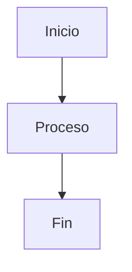
````

Veamos algunos tipos de gráficos `mermaid`:

---

#### 1. Diagramas de árboles (Diagramas de decisiones).

[ir a índice](#índice)

Son gráficos como diagramas de flujo para representar jerarquías y estructuras en árbol.

Representan:

---

##### a. Decisiones en procesos.

  [ir a índice](#índice)

-Ejemplo:
  
````markdown
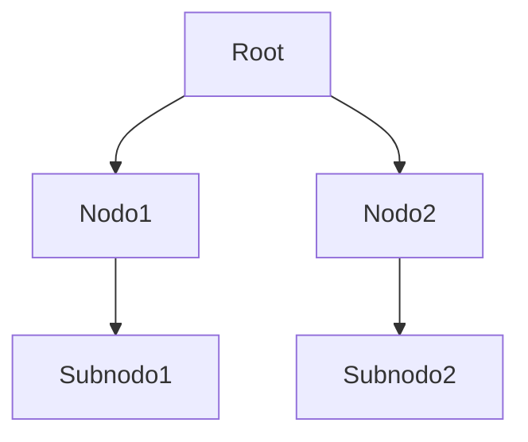
````


---

##### b. Diagramas de programación (Algoritmos).

[ir a índice](#índice)

Representan algoritmos.

---

###### 1. Para representar estructuras básicas.

[ir a índice](#índice)

-Ejemplos:

````markdown

````

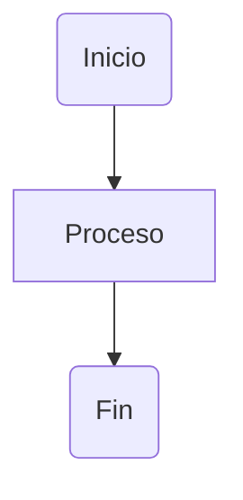

````markdown
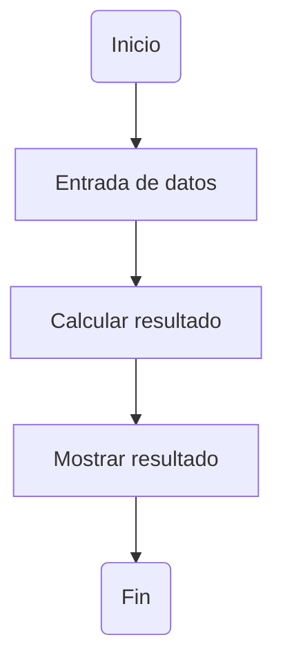
````


---

###### 2. Diagramas personalizados con estilos.

[ir a índice](#índice)

-Ejemplo:

````markdown
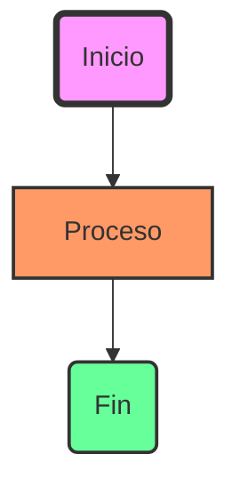
````


---

###### 3. Algoritmos bien extructurados.

[ir a índice](#índice)

-Ejemplo:

````markdown
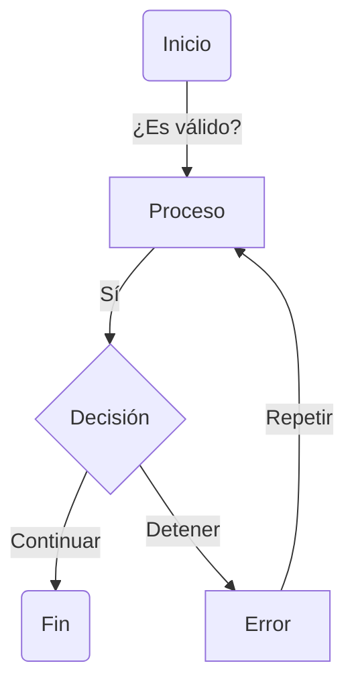
````


---

#### 2. Diagramas de secuencia.

[ir a índice](#índice)

Para modelar interacciones entre sistemas o actores en el tiempo.

-Ejemplos:

````markdown
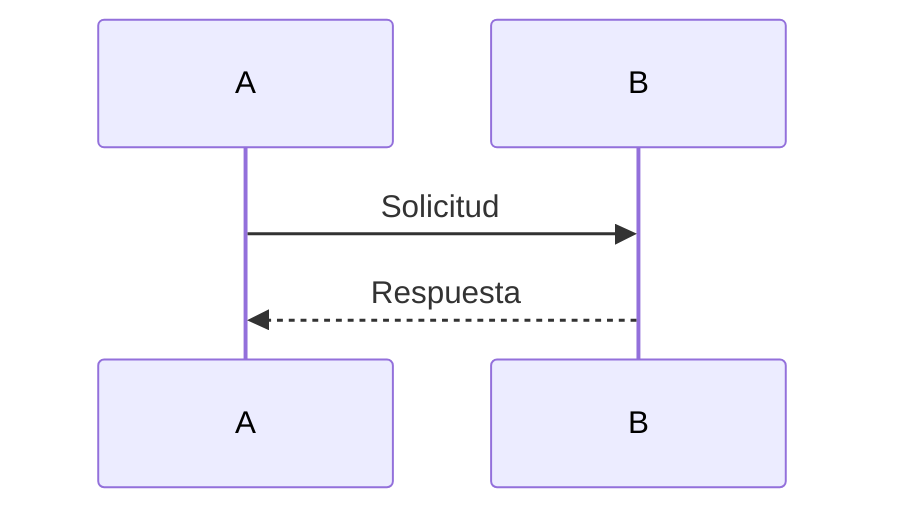
````


````markdown
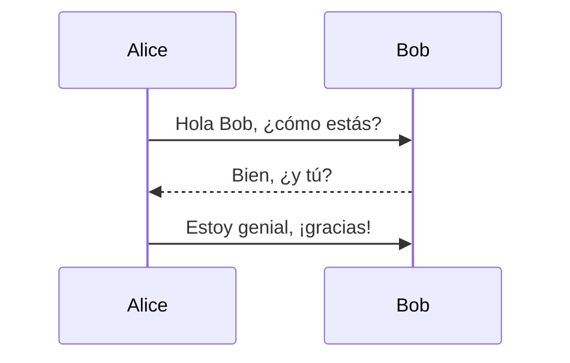
````


---

#### 3. Diagramas de `Gantt`.

[ir a índice](#índice)

Para planificar y visualizar cronogramas de proyectos.

-Ejemplos:

````markdown
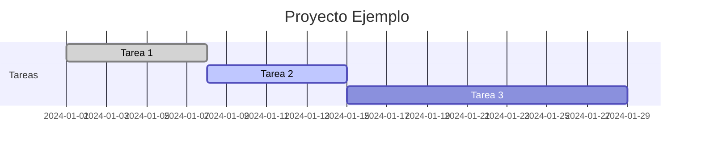
````


````markdown
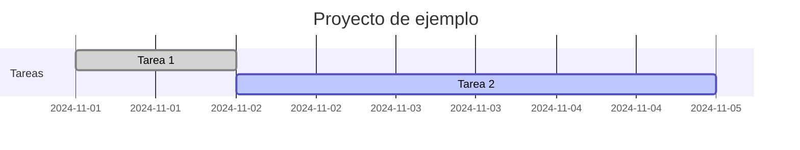
````


---

#### 4. Diagramas de mapeo mental.

[ir a índice](#índice)

Para organizar ideas en un formato jerárquico.

-Ejemplo:

````markdown
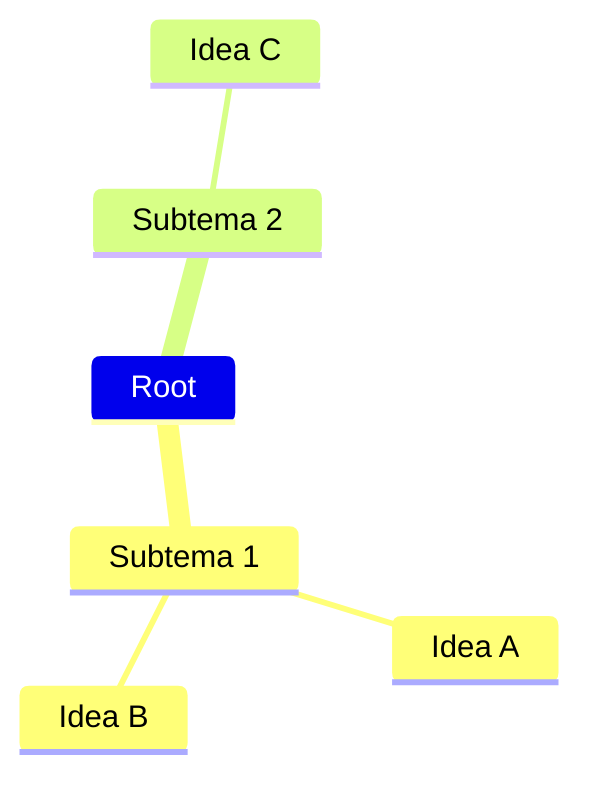
````

```mermaid
mindmap
    Root
        Subtema 1
            Idea A
            Idea B
        Subtema 2
            Idea C
```

---

#### 5. Diagramas de clase (`UML`).

[ir a índice](#índice)

Útil para representar clases y sus relaciones.

-Ejemplos:

````markdown
```mermaid
classDiagram
    ClaseA --> ClaseB : Relación
    ClaseA : +Método1()
    ClaseA : -Atributo
```
````

```mermaid
classDiagram
    ClaseA --> ClaseB : Relación
    ClaseA : +Método1()
    ClaseA : -Atributo
```

````markdown
```mermaid
classDiagram
    Animal <|-- Mamifero
    Animal <|-- Ave
    Animal : +nombre
    Animal : +edad
    Animal : +comer()
    Mamifero : +amantar()
    Ave : +volar()
```
````

```mermaid
classDiagram
    Animal <|-- Mamifero
    Animal <|-- Ave
    Animal : +nombre
    Animal : +edad
    Animal : +comer()
    Mamifero : +amantar()
    Ave : +volar()
```

---

#### 6. Diagramas de entidad-relación (`ERD`).

[ir a índice](#índice)

Para representar bases de datos y relaciones entre tablas.

-Ejemplos:

````markdown
```mermaid
erDiagram
    CLIENTE {
        string nombre
        string email
        string telefono
    }
    PEDIDO {
        int id
        string fecha
        float total
    }
    CLIENTE ||--o{ PEDIDO : realiza
```
````

```mermaid
erDiagram
    CLIENTE {
        string nombre
        string email
        string telefono
    }
    PEDIDO {
        int id
        string fecha
        float total
    }
    CLIENTE ||--o{ PEDIDO : realiza
```

````markdown
```mermaid
erDiagram
    CLIENTE {
        string nombre
        int edad
    }
    PEDIDO {
        int id
        string fecha
    }
    CLIENTE ||--o{ PEDIDO : hace
```
````

```mermaid
erDiagram
    CLIENTE {
        string nombre
        int edad
    }
    PEDIDO {
        int id
        string fecha
    }
    CLIENTE ||--o{ PEDIDO : hace
```

---

#### 7. Diagramas de cuadrículas.

  [ir a índice](#índice)

De éstos hay varios:

---

##### 1. Diagramas de cuadrículas (`Pie chart`).

[ir a índice](#índice)

Para representar datos en un gráfico circular.

-Ejemplo:

````markdown
```mermaid
pie
    title Distribución de Tareas:
    "Completadas" : 60
    "En Progreso" : 30
    "Pendientes" : 10
```
````

```mermaid
pie
    title Distribución de Tareas:
    "Completadas" : 60
    "En Progreso" : 30
    "Pendientes" : 10
```

---

##### 2. Diagramas de cuadrículas (`Requirement diagrams`).

[ir a índice](#índice)

Para documentar requisitos y dependencias.

-Ejemplo:

````markdown
```mermaid
requirementDiagram
    requirement requisito1 {
        id: 1
        text: Requisito principal
    }
    requirement requisito2 {
        id: 2
        text: Subrequisito
    }
```
````

```mermaid
requirementDiagram
    requirement requisito1 {
        id: 1
        text: Requisito principal
    }
    requirement requisito2 {
        id: 2
        text: Subrequisito
    }
```

---

##### 3. Diagramas de cuadrículas (`Timeline`).

[ir a índice](#índice)

Para crear cronogramas lineales.

-Ejemplo:

````markdown
```mermaid
timeline
    title Línea de tiempo:
    2020 : Inicio del proyecto
    2021 : Desarrollo
    2022 : Lanzamiento
```
````

```mermaid
timeline
    title Línea de tiempo:
    2020 : Inicio del proyecto
    2021 : Desarrollo
    2022 : Lanzamiento
```

---

##### 4. Diagramas de cuadrículas (`Git graph`).

[ir a índice](#índice)

Para representar historiales de ramas en `Git`.

-Ejemplo:

````markdown
```mermaid
gitGraph
    commit
    branch nuevaRama
    commit
    checkout main
    commit
```
````

```mermaid
gitGraph
    commit
    branch nuevaRama
    commit
    checkout main
    commit
```

---

#### 8. Diagramas de definición de objetos (`C4 diagrams`).

[ir a índice](#índice)

Para modelar arquitectura de software y sistemas.

-Ejemplo:

````markdown
```mermaid
C4Context
    Person(usuario, "Usuario", "Interacción con el sistema")
    System(sistema, "Sistema", "Procesa información")
```
````

```mermaid
C4Context
    Person(usuario, "Usuario", "Interacción con el sistema")
    System(sistema, "Sistema", "Procesa información")
```

---

#### 9. Diagramas de estados.

[ir a índice](#índice)

Para modelar máquinas con información de estados:

-Ejemplos:

````markdown
```mermaid
stateDiagram-v2
    [*] --> Encendido
    Encendido --> Apagado: Presionar botón
    Apagado --> Encendido: Presionar botón
    Encendido --> Standby: Inactividad
    Standby --> Encendido: Actividad detectada
```
````

```mermaid
stateDiagram-v2
    [*] --> Encendido
    Encendido --> Apagado: Presionar botón
    Apagado --> Encendido: Presionar botón
    Encendido --> Standby: Inactividad
    Standby --> Encendido: Actividad detectada
```

````markdown
```mermaid
stateDiagram-v2
    [*] --> Iniciado
    Iniciado --> Procesando : Acción
    Procesando --> Terminado : Completar
```
````

```mermaid
stateDiagram-v2
    [*] --> Iniciado
    Iniciado --> Procesando : Acción
    Procesando --> Terminado : Completar
```

---

#### 10. Diagramas de viaje del usuario (User Journey).

[ir a índice](#índice)

Para modelar las etapas de interacción del usuario.

-Ejemplo:

````markdown
```mermaid
journey
    title Viaje del Usuario:
    section Inicio
      Registro: 5: Usuario
      Navegación: 3: Usuario
    section Interacción
      Compra: 4: Usuario
      Soporte: 2: Usuario
```
````

```mermaid
journey
    title Viaje del Usuario:
    section Inicio
      Registro: 5: Usuario
      Navegación: 3: Usuario
    section Interacción
      Compra: 4: Usuario
      Soporte: 2: Usuario
```

---

#### 11. Diagramas de flujo cíclico.

[ir a índice](#índice)

Para modelar procesos iterativos.

-Ejemplo:

````markdown
```mermaid
graph LR
    A --> B --> C --> D --> A
```
````

```mermaid
graph LR
    A --> B --> C --> D --> A
```

---

#### 12. Diagramas de redes.

[ir a índice](#índice)

Representación de nodos y conexiones.

-Ejemplo:

````markdown
```mermaid
graph LR
    Servidor1[Servidor 1] -- HTTP --> Cliente1[Cliente 1]
    Servidor1 -- HTTP --> Cliente2[Cliente 2]
    Cliente1 -- Comunicación --> Cliente2
```
````

```mermaid
graph LR
    Servidor1[Servidor 1] -- HTTP --> Cliente1[Cliente 1]
    Servidor1 -- HTTP --> Cliente2[Cliente 2]
    Cliente1 -- Comunicación --> Cliente2
```

---

#### 13. Diagramas de pila.

[ir a índice](#índice)

Para representar elementos apilados o jerarquías simples.

-Ejemplo:

````markdown
```mermaid
graph TB
    Cliente --> Servidor --> BaseDeDatos
    Servidor --> Cache
```
````

```mermaid
graph TB
    Cliente --> Servidor --> BaseDeDatos
    Servidor --> Cache
```

---

### 19. Markdown en `GitHub`.

[ir a índice](#índice)

`GitHub` tiene características específicas para `Markdown`.

`Autolinks` a `issues` o `pull requests`:

```markdown
Esto cierra el `issue #123`.
Tablas de contenido automáticas: Usa un generador de tablas de contenido o plugins compatibles.
```

Esto cierra el `issue #123`.
Tablas de contenido automáticas: Usa un generador de tablas de contenido o plugins compatibles.

---

### 20. `Plugins` para `Markdown`.

[ir a índice](#índice)

Hay extensiones que expanden las capacidades de `Markdown`:

- `Markdown Extra`: Soporte para tablas, notas al pie, y más.
- `Pandoc`: Convierte `Markdown` en `PDF`, `Word`, etc.
- `Typora`: Editor `WYSIWYG` (Lo que ves es lo que obtienes).


---

## Resumen.

[ir a índice](#índice)

`Markdown` es un lenguaje sencillo para crear texto con formato que se convierte fácilmente a `HTML`. Los archivos `.md` son ideales para documentación, notas y contenido estructurado que se renderiza en plataformas como `GitHub`, `Reddit` y otros blogs. Su sintaxis es clara, fácil de aprender y usar, lo que lo convierte en una herramienta muy popular para desarrolladores y escritores.

---

<spam style="color: Magenta; background-color: LightGreen;"> Referencias a pie de página: </spam>
