<!--

* Curso: Albañiles digitales.

* Nombre del proyecto: "Manual Markdown".

* Autor: Koldo Sanmartín.

* Fecha: Viernes 29/11/2024.

* Lugar: Pamplona, España.

* Líneas de código: 1492.

* Descripción:

   Esto es un "breve" manual que intenta ser una guía básica sobre los archivos .md (Markdown), enfocado en cómo usar los archivos para poder verlos óptimamente renderizados.

-->

# <u style="color:green;"> Guía Básica sobre Archivos .md (Markdown). </u>

Los archivos **.md** son archivos de **Markdown**, un lenguaje de marcado ligero utilizado para formatear texto de manera simple. Markdown es popular debido a su facilidad de uso y legibilidad, lo que lo hace ideal para escribir documentación, blogs, README de proyectos, y otros tipos de contenido estructurado.

---

## <u style="color:green;"> ¿Para qué sirven los archivos `.md`? </u>

Los archivos `.md` se utilizan principalmente para:

1. **Documentación de proyectos**: En plataformas como GitHub, GitLab o Bitbucket, los archivos `README.md` se usan para describir el proyecto, cómo usarlo, cómo instalarlo, etc.
  
2. **Blogging y escritura**: Muchas plataformas de blogging permiten escribir en Markdown debido a su simplicidad.

3. **Notas y listas**: Son útiles para escribir notas organizadas, listas, resúmenes, etc.

---

## <u style="color:green;">¿Cómo funcionan los archivos `.md`?</u>

Markdown se convierte en un formato más enriquecido como HTML o PDF cuando se procesa con un convertidor adecuado (por ejemplo, GitHub convierte automáticamente los archivos `.md` en vistas visuales cuando los ves en su interfaz). Básicamente, Markdown es un formato **sin complicaciones** para escribir texto estructurado, sin tener que escribir etiquetas HTML complejas.

---

## <u style="color:green;"> Estructura básica de Markdown </u>

Aquí te explico cómo escribir archivos `.md` con algunos ejemplos comunes (<mark>25 apartados en total</mark>):

---

### 1. Encabezados.

Los encabezados se crean con `#`. El número de `#` indica el nivel del encabezado (de 1 a 6).

```markdown
#### Encabezado de nivel 4.
##### Encabezado de nivel 5.
###### Encabezado de nivel 6.
```

#### Encabezado de nivel 4.

##### Encabezado de nivel 5.

###### Encabezado de nivel 6.

Esto se convierte en un encabezado con diferente tamaño dependiendo del número de `#`.

---

### 2. Párrafos.

Los párrafos se escriben de forma normal, solo se separan por líneas vacías.

```markdown
Este es un párrafo. Al escribir más texto aquí, sigue siendo parte del mismo párrafo.

Este es otro párrafo.
```

Este es un párrafo. Al escribir más texto aquí, sigue siendo parte del mismo párrafo.

Este es otro párrafo.

---

### 3. Listas

- **Listas no ordenadas**: Se hacen con asteriscos (`*`), guiones (`-`) o más (`+`).

  ```markdown
  - Elemento 1.
  - Elemento 2.
  - Elemento 3.
  ```

  - Elemento 1.
  - Elemento 2.
  - Elemento 3.

- **Listas ordenadas**: Se hacen con números seguidos de un punto.

  ```markdown
  1. Primer elemento.
  2. Segundo elemento.
  3. Tercer elemento.
  ```

  1. Primer elemento.
  2. Segundo elemento.
  3. Tercer elemento
  
  ```markdown
    - Elemento 1.
    - Elemento 2.
      - Sub-elemento
    1. Elemento 1.
    2. Elemento 2.
       1. Sub-elemento.
  ```

  - Elemento 1.
  - Elemento 2.
    - Sub-elemento
  1. Elemento 1.
  2. Elemento 2.
     1. Sub-elemento.

---

### 4. Negrita, cursiva y tachado.

- Para **negrita**, usa dos asteriscos (`**`).
- Para *cursiva*, usa un asterisco (`*`).
- Para ~~tachado~~, usa dos virgulillas (`~~`) (Alt Gr + ñ).
- Para <u>subrayado</u> se usa html entre las etiquetas `<u>` y `</u>`.

```markdown
**Este texto está en negrita.**
*Este texto está en cursiva.*
~~Este texto está tachado.~~
<u>Este texto está en subrayado.</u>
```

**Este texto está en negrita.**
*Este texto está en cursiva.*
~~Este texto está tachado.~~
<u>Este texto está en subrayado.</u>

---

### 5. Enlaces.

Los enlaces se crean con corchetes `[]` para el texto visible y paréntesis `()` para la URL.

```markdown
[Google](https://www.google.com)
[Enlace con título](https://www.google.com "Ir a Google")
```

[Google](https://www.google.com)
[Enlace con título](https://www.google.com "Ir a Google")

---

### 6. Imágenes.

Las imágenes son similares a los enlaces, pero se agrega un signo de exclamación `!` antes del corchete.

```markdown


```


---

### 7. Citas.

Las citas se hacen con el símbolo de mayor que (`>`).

```markdown
> Esto es una cita.
>> Cita anidada.
```

> Este es un texto citado.
>> Cita anidada.

---

### 8. Código.

- Para **código en línea**, utiliza una sola **tilde invertida** (\`).
  
   ```markdown
   Este es un `código en línea`.
   ```

   Este es un `código en línea`.

  - Puedes anidar un código de línea dentro de otro, añadiendo un acento agudo más `` (`) ``, cada vez. Sirve por si te encuentras con otro acento agudo que pertenece al texto en sí, no a markdown.

     ```markdown
     Ejemplo de uso `` (`) ``.
     ```

    Ejemplo de uso `` (`) ``.

- Para **bloques de código**, usa tres tildes invertidas (\`\`\`) o sangrías de 4 espacios.

   ```markdown
   ```

   ```javascript
   función saludo() {
      console.log("Hola");
   }
   ```

   ```markdown
   ```

   ```javascript
   console.log('Hola, Markdown!');
   ```

  - Puedes anidar un bloques de código dentro de otros, añadiendo un acento agudo más `` (`) ``, cada vez.

   `````markdown
   ````markdown
   ```javascript
   función saludo() {
      console.log("Hola");
   }
   ```
   ````
   `````

---

### 9. Tablas.

Las tablas se crean utilizando guiones `(-)` y barras verticales `(|)`.

```markdown
| Columna 1 | Columna 2 | Columna 3 |
|-----------|-----------|-----------|
| Valor 1   | Valor 2   | Valor 3   |
| Valor A   | Valor B   | Valor C   |
```

| Columna 1 | Columna 2 | Columna 3 |
|-----------|-----------|-----------|
| Valor 1   | Valor 2   | Valor 3   |
| Valor A   | Valor B   | Valor C   |

Esto crea una tabla estructurada.

```markdown
| Columna 1 | Columna 2 | Columna 3 |
|-----------|-----------|-----------|
| Dato 1    | Dato 2    | Dato 3    |
| Dato A    | Dato B    | Dato C    |
```

| Columna 1 | Columna 2 | Columna 3 |
|-----------|-----------|-----------|
| Dato 1    | Dato 2    | Dato 3    |
| Dato A    | Dato B    | Dato C    |

Puedes alinear el texto a la izquierda `(:---)`, a la derecha `(---:)`, o centrarlo `(:---:)`, dependiendo de dónde coloque los dos puntos `(:)`:

```markdown
| Columna A      | Columna B      | Columna C      |
|:---------------|:--------------:|---------------:|
| Alineada a la izquierda | Centrada         | Alineada a la derecha |
|mas|datos|a escribir|
```

| Columna A      | Columna B      | Columna C      |
|:---------------|:--------------:|---------------:|
| Alineada a la izquierda | Centrada         | Alineada a la derecha |
|mas|datos|a escribir|

Tablas con filas de separación:

Las tablas en Markdown pueden incluir filas de separación para mejorar la legibilidad del código fuente. Por ejemplo, puedes agregar filas vacías para separar visualmente diferentes secciones:

| Columna 1 | Columna 2 |
|-----------|-----------|
| Dato A    | Dato B    |

| Columna 3 | Columna 4 |
|-----------|-----------|
| Dato C    | Dato D    |

---

### 10. Separadores.

Los separadores o líneas horizontales se crean con tres guiones `(---)`, asteriscos `(***)` o guiones bajos `(___)`, (aunque es mejor que uses el mismo siempre si no quieres que el markdownslint te dé problemas).

```markdown
---
```

---

### 11. Tareas.

Crea listas de tareas con - [ ] o - [x].

```Markdown
- [x] Tarea completada.
- [ ] Tarea pendiente.
(puedes seleccionar un recuadro en el mismo markdown renderizado).
```

- [x] Tarea completada.
- [ ] Tarea pendiente.

(puedes seleccionar un recuadro en el mismo markdown renderizado).

---

### 12. Comentarios en Markdown.

Markdown no tiene comentarios nativos, pero puedes usar HTML para ello:

```Markdown
<!-- No se verá renderizado -->
<!-- Esto es un comentario -->
```

<!-- No se verá renderizado -->
<!-- Esto es un comentario -->

---

### 13. Escapar caracteres.

Para mostrar caracteres especiales como `*, _, #`, etc., usa una barra invertida ` \ `.

```markdown
\*No estoy en cursiva o negrita.\*
```

\*No estoy en cursiva o negrita.\*

---

### 14. Referencias de enlaces.

Puedes definir enlaces de forma reutilizable al final del documento:

```markdown
Esto es un [enlace][google].
<!-- Esto lo escribes al final del documento -->
[google]: https://www.google.com
```

Esto es un [enlace][google].
<!-- Esto lo escribes al final del documento -->
[google]: https://www.google.com

---

### 15. Markdown avanzado con HTML.

Puedes mezclar HTML con Markdown si necesitas más personalización.

```markdown
<p style="color:red;">Esto es HTML dentro de Markdown en rojo.</p>
```

<p style="color:red;">Esto es HTML dentro de Markdownen rojo.</p>

!!! tip Consejo:
     Puedes configurar `markdownlint` para permitir todas las etiquetas `HTML` en `Markdown` deshabilitando completamente la `regla MD033`. Para hacerlo, puedes configurar el archivo `settings.json` añadiendo el código `"MD033": false`:
     Configuración para aceptar todas las etiquetas `HTML`
     -`json`:
     {
         "files.autoSave": "afterDelay",
         "window.customTitleBarVisibility": "auto",
         "workbench.sideBar.location": "right",
         "workbench.colorTheme": "Andromeda",
         "markdownlint.config": {
             "MD033": false
         }
     }

---

### 16. Admoniciones (Notas, consejos, advertencias):

---

- #### 1. En plataformas como GitHub o Jekyll, puedes usar admoniciones con estilo:

```markdown
> **Nota**: Recuerda revisar la documentación oficial.
> **Consejo**: Puedes usar extensiones de Markdown.
> **Información importante**: Este bloque resalta detalles clave.
> **Advertencia**: Ten cuidado al realizar este paso.
> **Éxito**: ¡La operación fue exitosa!
> **Pista**: Puedes usar este truco para mejorar tu flujo de trabajo.
```

> **Nota**: Recuerda revisar la documentación oficial.
> **Consejo**: Puedes usar extensiones de Markdown.
> **Información importante**: Este bloque resalta detalles clave.
> **Advertencia**: Ten cuidado al realizar este paso.
> **Éxito**: ¡La operación fue exitosa!
> **Pista**: Puedes usar este truco para mejorar tu flujo de trabajo.

---

- #### 2. En sistemas que renderizan HTML o soportan Markdown extendido, puedes usar colores en el texto:

```markdown
<span style="color: blue;">💡 Consejo:</span> Usa colores para resaltar información.
O usar etiquetas de fondo:
```

<span style="color: blue;">💡 Consejo:</span> Usa colores para resaltar información.
O usar etiquetas de fondo:

```markdown
<span style="background-color: yellow;">⚠️ Advertencia:</span> Este fondo es personalizable.
```

<span style="background-color: yellow;">⚠️ Advertencia:</span> Este fondo es personalizable.

---

- #### 3. Admoniciones personalizadas en HTML.

Si estás renderizando Markdown a HTML, puedes crear bloques con colores o íconos personalizados.

```markdown
<div style="border: 1px solid green; padding: 10px; background-color: #e7f5e7;">
<strong>Éxito:</strong> Operación completada correctamente.
</div>
```

<div style="border: 1px solid green; padding: 10px; background-color: #e7f5e7;">
<strong>Éxito:</strong> Operación completada correctamente.
</div>

---

- #### 4. Admoniciones en Jupyter Notebook.

Si usas Markdown dentro de Jupyter Notebooks, puedes emplear celdas para destacar puntos importantes con estilos CSS o simplemente con emojis para mayor claridad:

```markdown
> ⚠️ **Advertencia**: Recuerda guardar tu trabajo antes de ejecutar este paso.
```

> ⚠️ **Advertencia**: Recuerda guardar tu trabajo antes de ejecutar este paso.

```markdown
ℹ️ **Información**: Este paso es opcional, pero recomendado.
```

ℹ️ **Información**: Este paso es opcional, pero recomendado.

```markdown
⚠️ **Advertencia**: El archivo será eliminado permanentemente.
```

⚠️ **Advertencia**: El archivo será eliminado permanentemente.

```markdown
✅ **Éxito**: La operación se completó sin problemas.
```

✅ **Éxito**: La operación se completó sin problemas.

```markdown
💡 **Consejo**: Usa atajos de teclado para mejorar la velocidad.
```

💡 **Consejo**: Usa atajos de teclado para mejorar la velocidad.

---

- #### 5. En sistemas avanzados como MkDocs:

```markdown
!!! note Nota
    Este es un bloque de nota. Se usa para información general.
```

!!! note Nota
    Este es un bloque de nota. Se usa para información general.

```markdown
!!! tip Consejo
    Este es un bloque de consejo. Ayuda a optimizar tu experiencia.
```

!!! tip Consejo
    Este es un bloque de consejo. Ayuda a optimizar tu experiencia.

```markdown
!!! success Éxito
    ¡Este es un bloque de éxito! Indica que algo funcionó correctamente.
```

!!! success Éxito
    ¡Este es un bloque de éxito! Indica que algo funcionó correctamente.

```markdown
!!! warning Advertencia
    Este es un bloque de advertencia. Úsalo para llamar la atención sobre riesgos.
```

!!! warning Advertencia
    Este es un bloque de advertencia. Úsalo para llamar la atención sobre riesgos.

```markdown
!!! danger Peligro
    Este es un bloque de peligro. Resalta acciones potencialmente destructivas.
```

!!! danger Peligro
    Este es un bloque de peligro. Resalta acciones potencialmente destructivas.

```markdown
!!! failure Fallo
    Algo salió mal, por favor inténtalo de nuevo.
```

!!! failure Fallo
    Algo salió mal, por favor inténtalo de nuevo.

```markdown
!!! example Ejemplo
    Aquí tienes un ejemplo que puedes seguir.
```

!!! example Ejemplo
    Aquí tienes un ejemplo que puedes seguir.

---

### 17. Matemáticas con LaTeX [MathJax o KaTeX (Fórmulas matemáticas)].

Si estás en un entorno que lo soporte, como Jupyter Notebooks o MkDocs, puedes usar fórmulas matemáticas.

Algunos motores de Markdown permiten usar notación matemática con $.

- #### 1. Ecuaciones en línea.

Las ecuaciones en línea se escriben entre signos de dólar (\$). Estas ecuaciones se alinean con el texto.

-Ejemplos:

```markdown
La famosa ecuación de Einstein es: $ E = mc^2 $.
```

La famosa ecuación de Einstein es: $ E = mc^2 $.

```markdown
La fórmula de la cuadrática es $ x = \frac{-b \pm \sqrt{b^2 - 4ac}}{2a} $.
```

La fórmula de la cuadrática es $ x = \frac{-b \pm \sqrt{b^2 - 4ac}}{2a} $.

- #### 2. Ecuaciones en bloque.

Las ecuaciones en bloque se colocan entre dos conjuntos de signos de dólar dobles ($$). Estas ecuaciones se muestran centradas y en una línea separada.

-Ejemplo:

```markdown
La fórmula de la cuadrática es: 
$$ x = \frac{-b \pm \sqrt{b^2 - 4ac}}{2a} $$.
```

La fórmula de la cuadrática es:
$$ x = \frac{-b \pm \sqrt{b^2 - 4ac}}{2a} $$

- #### 3. Sumas y productos.

Para escribir sumas o productos, puedes usar los símbolos `\sum` y `\prod`:

-Ejemplos:

```markdown
Suma de una serie:
$$ \sum_{i=1}^{n} i^2 = \frac{n(n+1)(2n+1)}{6} $$
```

Suma de una serie:
$$ \sum_{i=1}^{n} i^2 = \frac{n(n+1)(2n+1)}{6} $$

```markdown
Producto de una secuencia: $$ \prod_{i=1}^{n} i = n! $$
```

Producto de una secuencia: $$ \prod_{i=1}^{n} i = n! $$

- #### 4. Fracciones.

Puedes usar `\frac{numerador}{denominador}` para escribir fracciones:

-Ejemplo:

```markdown
$$ \frac{1}{2} + \frac{1}{3} = \frac{5}{6} $$
```

$$ \frac{1}{2} + \frac{1}{3} = \frac{5}{6} $$

- #### 5. Radicales.

Para escribir raíces cuadradas usa `\sqrt{expresión}` y otras raíces usa `\sqrt[n]{expresión}`, siendo `[n]` el numero de raíz que desees:

- Raíz cuadrada:

```markdown
$$ \sqrt{a^2 + b^2} = c $$
```

$$ \sqrt{a^2 + b^2} = c $$

- Otras raíces:

```markdown
\sqrt[3]{x + 1} + \sqrt[4]{x^2} - \sqrt[5]{y_1}
```

$$ \sqrt[3]{x + 1} + \sqrt[4]{x^2} - \sqrt[5]{y_1} $$

- #### 6. Matrices.

Las matrices se escriben utilizando el entorno `\begin{matrix} ... \end{matrix}` para matrices  sin corchetes o `\begin{bmatrix} ... \end{bmatrix}` para matrices entre corchetes.

- Matriz simple entre corchetes:

```markdown
$$ \begin{bmatrix} a & b \\ c & d \end{bmatrix} $$
```

$$ \begin{bmatrix} a & b \\ c & d \end{bmatrix} $$

- Matriz simple sin corchetes:

```markdown
$$ \begin{matrix} a & b \\ c & d \end{matrix} $$
```

$$ \begin{matrix} a & b \\ c & d \end{matrix} $$

- #### 7. Exponentes y subíndices.

Puedes usar `^` para exponentes y `_` para subíndices.

- Exponentes:

```markdown
$$ a^n = \sum_{i=1}^n i^2 $$
```

$$ a^n = \sum_{i=1}^n i^2 $$

- Subíndices:

```markdown
$$ a_i = b_{i+1} $$
```

$$ a_i = b_{i+1} $$

- #### 8. Integrales.

Las integrales se escriben utilizando `\int` para la integral definida o indefinida:

```markdown
Teorema Fundamental del Cálculo: 
$$ \int_a^b f(x) dx = F(b) - F(a) $$
```

Teorema Fundamental del Cálculo:
$$ \int_a^b f(x) dx = F(b) - F(a) $$

- #### 9. Límites.

Usa `\lim` para escribir límites:

```markdown
$$ \lim_{x \to \infty} \frac{1}{x} = 0 $$
```

$$ \lim_{x \to \infty} \frac{1}{x} = 0 $$

- #### 10. Teoremas y notación matemática avanzada.

Puedes escribir teoremas y notación matemática avanzada de manera similar:

Teorema de Pitágoras:

```markdown
$$ cat_a^2 + cat_b^2 = hip^2\ ;\ 4^2 + 3^2 = 5^2\ ;\ 16 + 9 = 25 $$
```

$$ cat_a^2 + cat_b^2 = hip^2 \ ;\ 4^2 + 3^2 = 5^2\ ;\ 16 + 9 = 25 $$

---

### 18. Colores y estilos personalizados.

- Aunque Markdown puro no admite colores, puedes usar HTML en algunos casos:

```markdown
<span style="color: green;">Texto en verde.</span>
```

<span style="color: green;">Texto en verde.</span>

Para colores específicos, necesitarás soporte CSS (en archivos .md renderizados como HTML).

- Etiquetas personalizadas.

Con algunos sistemas avanzados puedes añadir etiquetas con estilos únicos:

```markdown
<mark>Texto resaltado.</mark>
```

<mark>Texto resaltado.</mark>

---

### 19. Detalles y resúmenes (collapsible).

En Markdown avanzado o con soporte HTML, puedes crear bloques colapsables.

```markdown
<details>
  <summary>Haz clic para expandir.</summary>
  Aquí está el contenido oculto.
</details>
```

<details>
  <summary>Haz clic para expandir.</summary>
  Aquí está el contenido oculto.
</details>

---

### 20. Atajos de Markdown para enlaces internos.

En documentación extensa, puedes crear enlaces a secciones del mismo documento:

```markdown
[Ir a la sección de código](#código)
## Código
Aquí está el contenido de la sección.
```

[Ir a la sección de código](#código)

#### Código.

Aquí está el contenido de la sección.

---

### 21. Extensiones de Markdown.

Algunos entornos permiten usar extensiones. Uno muy comúnmente usado son los diagramas mermaid (`Mermaid.js`).

- Para que funcione, tienes que sustituir el título `markdown` encerrado entre los dos  ``triples acentos agudos (```)`` por el título `mermaid`, tal que así:

````markdown
```markdown
graph TD
A[Inicio] --> B[Proceso]
B --> C[Fin]
```
````

````markdown
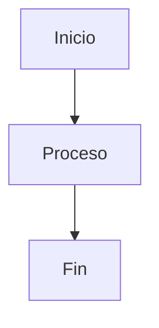
````

Veamos algunos tipos de gráficos `mermaid`:

---

- #### 1. Diagramas de árboles (Diagramas de decisiones).

Son gráficos como diagramas de flujo para representar jerarquías y estructuras en árbol.

Representan:

- ##### a. Decisiones en procesos.
  
     ````markdown
     ```mermaid
     graph TD
        Root --> Nodo1
        Root --> Nodo2
        Nodo1 --> Subnodo1
        Nodo2 --> Subnodo2
     ```
     ````
  
     ```mermaid
     graph TD
        Root --> Nodo1
        Root --> Nodo2
        Nodo1 --> Subnodo1
        Nodo2 --> Subnodo2
     ```

- ##### b. Diagramas de programación (Algoritmos).

  - Para representar estructuras básicas:

    ````markdown
    ```mermaid
    graph TD
    A[Inicio] --> B[Proceso] --> C[Fin]
    ```
    ````

    ```mermaid
    graph TD
    A(Inicio) --> B[Proceso] --> C(Fin)
    ```

    ````markdown
    ```mermaid
    graph TD
        A(Inicio) --> BEntrada[Entrada de datos]
        BEntrada --> CProceso[Calcular resultado]
        CProceso --> DSalida[Mostrar resultado]
        DSalida --> E(Fin)
    ```
    ````

    ```mermaid
    graph TD
        A(Inicio) --> BEntrada[Entrada de datos]
        BEntrada --> CProceso[Calcular resultado]
        CProceso --> DSalida[Mostrar resultado]
        DSalida --> E(Fin)
    ```

  - Diagramas personalizados con estilos:

     ````markdown
     ```mermaid
     graph TD
         A(Inicio) --> B[Proceso]
         B --> C(Fin)
         style A fill:#f9f,stroke:#333,stroke-width:4px
         style B fill:#f96,stroke:#333,stroke-width:2px
         style C fill:#6f9,stroke:#333,stroke-width:2px
     ```
     ````
  
     ```mermaid
     graph TD
         A(Inicio) --> B[Proceso]
         B --> C(Fin)
         style A fill:#f9f,stroke:#333,stroke-width:4px
         style B fill:#f96,stroke:#333,stroke-width:2px
         style C fill:#6f9,stroke:#333,stroke-width:2px
     ```

  - Algoritmos bien extructurados:

     ````markdown
     ```mermaid
     graph TD
        A(Inicio) --> | ¿Es válido? | B[Proceso]
        B --> | Sí | C{Decisión}
        C --> | Continuar | D(Fin)
        C --> | Detener | E[Error] -->| Repetir | B
     ```
     ````
  
     ```mermaid
     graph TD
        A(Inicio) --> | ¿Es válido? | B[Proceso]
        B --> | Sí | C{Decisión}
        C --> | Continuar | D(Fin)
        C --> | Detener | E[Error] -->| Repetir | B
     ```

---

- #### 2. Diagramas de secuencia.

Para modelar interacciones entre sistemas o actores en el tiempo.

Ejemplos:

````markdown
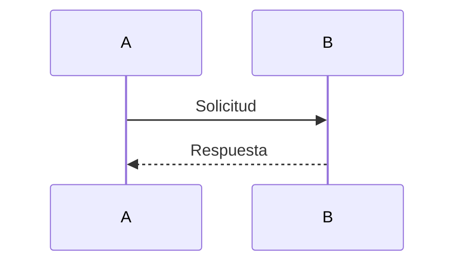
````


````markdown
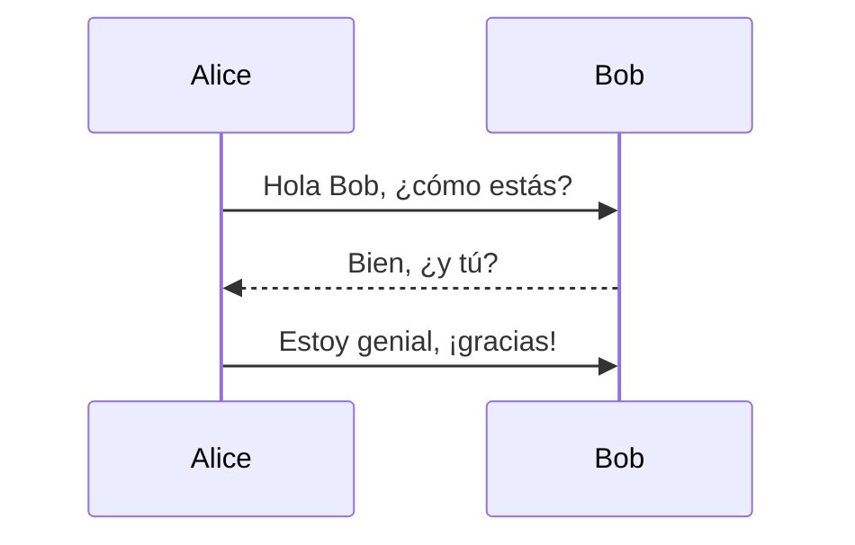
````


---

- #### 3. Diagramas de Gantt.

Para planificar y visualizar cronogramas de proyectos.

-Ejemplos:

````markdown
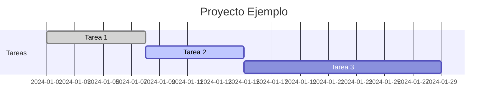
````


````markdown
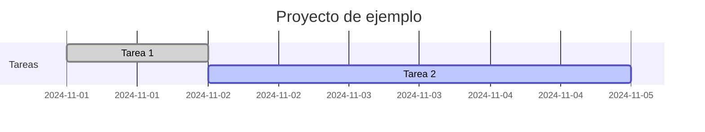
````


---

- #### 4. Diagramas de cuadrículas (Git graph).

Para representar historiales de ramas en Git.

-Ejemplo:

````markdown
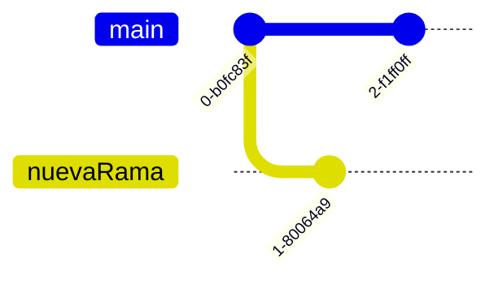
````

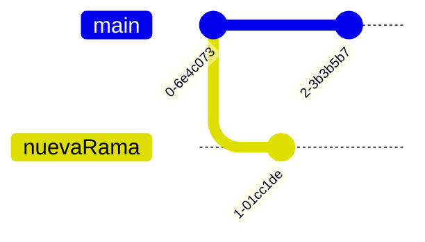

---

- #### 5. Diagramas de mapeo mental.

Para organizar ideas en un formato jerárquico.

-Ejemplo:

````markdown
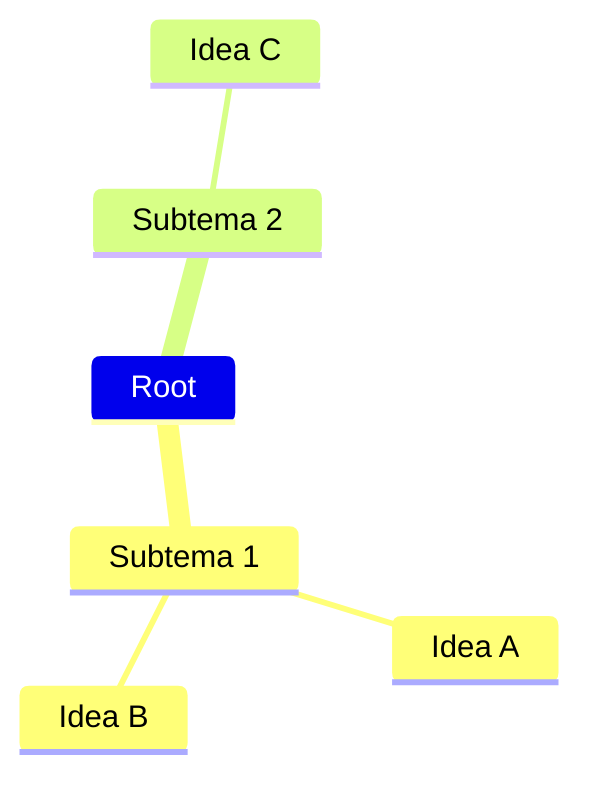
````


---

- #### 6. Diagramas de clase (UML).

Útil para representar clases y sus relaciones.

-Ejemplos:

````markdown
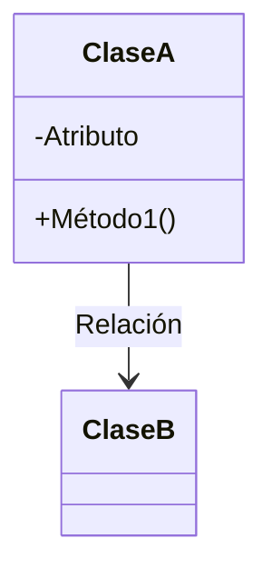
````


````markdown
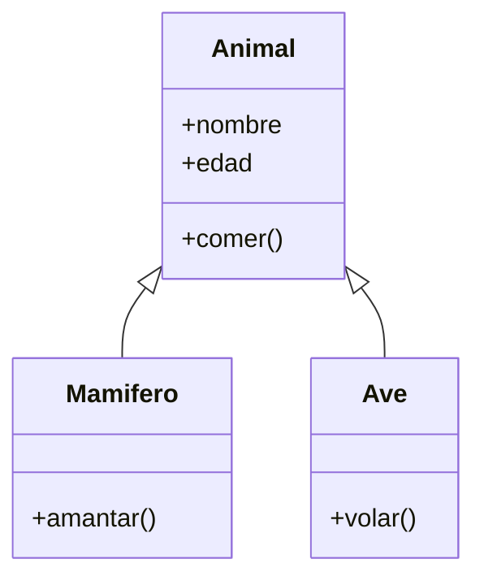
````


---

- #### 7. Diagramas de entidad-relación (ERD).

Para representar bases de datos y relaciones entre tablas.

-Ejemplos:

````markdown
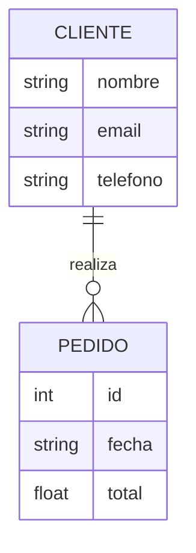
````


````markdown
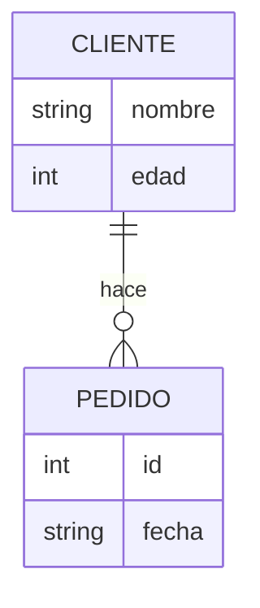
````

```mermaid
erDiagram
    CLIENTE {
        string nombre
        int edad
    }
    PEDIDO {
        int id
        string fecha
    }
    CLIENTE ||--o{ PEDIDO : hace
```

---

- #### 8. Diagramas de cuadrícula.

  - ##### 1. Diagramas de cuadrícula(Pie chart).

      Para representar datos en un gráfico circular.

      ````markdown
      ```mermaid
      pie
          title Distribución de Tareas:
          "Completadas" : 60
          "En Progreso" : 30
          "Pendientes" : 10
      ```
      ````

      ```mermaid
      pie
          title Distribución de Tareas:
          "Completadas" : 60
          "En Progreso" : 30
          "Pendientes" : 10
      ```

  - ##### 2. Diagramas de cuadrículas (Requirement diagrams).

      Para documentar requisitos y dependencias.

      ````markdown
      ```mermaid
      requirementDiagram
          requirement requisito1 {
              id: 1
              text: Requisito principal
          }
          requirement requisito2 {
              id: 2
              text: Subrequisito
          }
      ```
      ````

      ```mermaid
      requirementDiagram
          requirement requisito1 {
              id: 1
              text: Requisito principal
          }
          requirement requisito2 {
              id: 2
              text: Subrequisito
          }
      ```

  - ##### 3. Diagramas de cuadrículas (Timeline).

      Para crear cronogramas lineales.

      ````markdown
      ```mermaid
      timeline
          title Línea de tiempo:
          2020 : Inicio del proyecto
          2021 : Desarrollo
          2022 : Lanzamiento
      ```
      ````

      ```mermaid
      timeline
          title Línea de tiempo:
          2020 : Inicio del proyecto
          2021 : Desarrollo
          2022 : Lanzamiento
      ```

---

- #### 9. Diagramas de definición de objetos (C4 diagrams).

Para modelar arquitectura de software y sistemas.

-Ejemplo:

````markdown
```mermaid
C4Context
    Person(usuario, "Usuario", "Interacción con el sistema")
    System(sistema, "Sistema", "Procesa información")
```
````

```mermaid
C4Context
    Person(usuario, "Usuario", "Interacción con el sistema")
    System(sistema, "Sistema", "Procesa información")
```

---

- #### 10. Diagramas de estados.

Para modelar máquinas con información de estados:

-Ejemplos:

````markdown
```mermaid
stateDiagram-v2
    [*] --> Encendido
    Encendido --> Apagado: Presionar botón
    Apagado --> Encendido: Presionar botón
    Encendido --> Standby: Inactividad
    Standby --> Encendido: Actividad detectada
```
````

```mermaid
stateDiagram-v2
    [*] --> Encendido
    Encendido --> Apagado: Presionar botón
    Apagado --> Encendido: Presionar botón
    Encendido --> Standby: Inactividad
    Standby --> Encendido: Actividad detectada
```

````markdown
```mermaid
stateDiagram-v2
    [*] --> Iniciado
    Iniciado --> Procesando : Acción
    Procesando --> Terminado : Completar
```
````

```mermaid
stateDiagram-v2
    [*] --> Iniciado
    Iniciado --> Procesando : Acción
    Procesando --> Terminado : Completar
```

---

- #### 11. Diagramas de viaje del usuario (User Journey).

Para modelar las etapas de interacción del usuario:

````markdown
```mermaid
journey
    title Viaje del Usuario:
    section Inicio
      Registro: 5: Usuario
      Navegación: 3: Usuario
    section Interacción
      Compra: 4: Usuario
      Soporte: 2: Usuario
```
````

```mermaid
journey
    title Viaje del Usuario:
    section Inicio
      Registro: 5: Usuario
      Navegación: 3: Usuario
    section Interacción
      Compra: 4: Usuario
      Soporte: 2: Usuario
```

---

- #### 12. Diagramas de flujo cíclico.

Para modelar procesos iterativos:

````markdown
```mermaid
graph LR
    A --> B --> C --> D --> A
```
````

```mermaid
graph LR
    A --> B --> C --> D --> A
```

---

- #### 13. Diagramas de redes.

Representación de nodos y conexiones:

````markdown
```mermaid
graph LR
    Servidor1[Servidor 1] -- HTTP --> Cliente1[Cliente 1]
    Servidor1 -- HTTP --> Cliente2[Cliente 2]
    Cliente1 -- Comunicación --> Cliente2
```
````

```mermaid
graph LR
    Servidor1[Servidor 1] -- HTTP --> Cliente1[Cliente 1]
    Servidor1 -- HTTP --> Cliente2[Cliente 2]
    Cliente1 -- Comunicación --> Cliente2
```

---

- #### 14. Diagramas de pila.

Para representar elementos apilados o jerarquías simples:

````markdown
```mermaid
graph TB
    Cliente --> Servidor --> BaseDeDatos
    Servidor --> Cache
```
````

```mermaid
graph TB
    Cliente --> Servidor --> BaseDeDatos
    Servidor --> Cache
```

---

### 22. Archivos incrustados.

- i. Puedes incluir imágenes, videos, o enlaces a otros archivos en plataformas que lo permitan:

```markdown

[Descargar archivo](ruta/archivo.zip)
```


[Descargar archivo](ruta/archivo.zip)

- ii. Lista de referencias de pie de página.

Puedes añadir referencias al pie del documento:

```markdown
Esto es un texto con una referencia[^1].
[^1]: Esta es la referencia al pie de página.
```

Esto es un texto con una referencia[^1].
[^1]: Esta es la referencia al pie de página.

---

### 23. Tablas de contenido (TOC).

En herramientas como MkDocs, puedes generar un índice automáticamente:

```markdown
[[TOC]]
```

[[TOC]]

---

### 24. Markdown en GitHub.

GitHub tiene características específicas para Markdown.

Autolinks a issues o pull requests:

```markdown
Esto cierra el issue #123.
Tablas de contenido automáticas: Usa un generador de tablas de contenido o plugins compatibles.
```

Esto cierra el issue #123.
Tablas de contenido automáticas: Usa un generador de tablas de contenido o plugins compatibles.

---

### 25. Plugins para Markdown.

Hay extensiones que expanden las capacidades de Markdown:

- Markdown Extra: Soporte para tablas, notas al pie, y más.
- Pandoc: Convierte Markdown en PDF, Word, etc.
- Typora: Editor WYSIWYG (Lo que ves es lo que obtienes).

---

## Creando y editando archivos `.md`.

1. **Cómo crear un archivo `.md`**:
   - Puedes crear un archivo `.md` con cualquier editor de texto (por ejemplo, `Visual Studio Code`, `Sublime Text`, `Atom`).
   - Simplemente crea un archivo con extensión `.md`, como `README.md`, y empieza a escribir en Markdown.

2. **Cómo ver el archivo `.md` renderizado**:
   - En plataformas como **GitHub**, cuando subes un archivo `.md`, lo verás renderizado en su interfaz web (convertido a `HTML`).
   - Si lo trabajas en tu máquina local, algunos editores de texto (como `Visual Studio Code`) permiten previsualizar el archivo `Markdown`.

3. **Dónde usar `Markdown`**:
   - **GitHub**: Para los archivos `README.md`, `documentación de proyectos`, `wikis`.
   - **Foros y plataformas de discusión** (como `Reddit`).
   - **Blogs y sitios estáticos**: Muchas plataformas de blogging como `Jekyll` o `Hugo` usan `Markdown`.

---

## Ventajas de `Markdown`.

- **Simplicidad**: No necesitas recordar muchas etiquetas o sintaxis complejas.
- **Legibilidad**: El texto en Markdown es fácilmente legible, incluso si no está renderizado.
- **Portabilidad**: Los archivos `.md` son simples archivos de texto que puedes abrir y editar en cualquier lugar.

---

## Resumen.

`Markdown` es un lenguaje sencillo para crear texto con formato que se convierte fácilmente a `HTML`. Los archivos `.md` son ideales para documentación, notas y contenido estructurado que se renderiza en plataformas como `GitHub`, `Reddit` y otros blogs. Su sintaxis es clara, fácil de aprender y usar, lo que lo convierte en una herramienta muy popular para desarrolladores y escritores.
